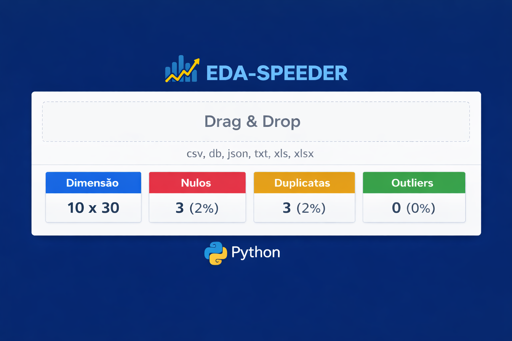
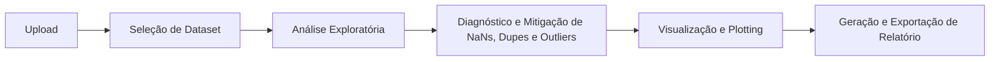

<div align="center">

# EDA-Speeder

Ferramenta leve e prática de *Análise de Dados Exploratória* e *Preparação de Dados*.



[Funcionalidades](#funcionalidades) | [Instalação](#instalação) | [Nosso Workflow](#nosso-workflow)

Ferramentas:
  


Detalhes:


Suporte:


</div>

## Nosso Objetivo

Criar uma ferramenta **rápida, simples e multiplataforma** com o propósito de adiantar as etapas do framework CRISP-DM:

- **Data Understanding**
- **Data Preparation** 
- **MVP Modeling** 

Através de gestos como drag-drop e funcionalidades soluções em  1-click.

## Nosso Workflow:



## Funcionalidades
<details> 
<summary><strong>Drag & Drop</strong></summary>

- Suporta csv, db, json, txt, xls, xlsx
- Armazenamento seguro no diretório do projeto
- Detecção automática de tabelas e colunas

> **W.I.P: Melhorias de suporte em andamento**
</details>

<details> 
<summary><strong>Widgets e Preview</strong></summary>

- Visualização das primeiras/últimas linhas
- Tipagem automática de dados
- Alteração manual de nome e tipo

> *Alterações inadequadas de tipagem podem causar inconsistências e erros no Dataset*

</details>

<details> <summary><strong>Nulls, Dupes e Outliers</strong></summary>

- Imputação: valor fixo ou estatístico (moda, média, mediana)
- Remoção: linhas ou colunas
- Ignorar e Manter valores

> **W.I.P: Melhorias em diagnóstico e tratamento em andamento**

</details>
<details> <summary><strong>Visualização e Plotagem</strong></summary>

- Criação simplificada de gráficos
- Integração com relatórios

> **W.I.P: Ainda em Desenvolvimento**

</details>

<details> <summary><strong>Exportação</strong></summary>

- PDF
- DOCX
- IPYNB (Jupyter Notebook)

> **W.I.P: Ainda em Desenvolvimento**

</details>

## Roadmap

- [x] Plataformas:
  - [x] Windows 10/11
  - [x] Linux (QT Web Engine)
  - [ ] Linux (GTK)
  - [ ] Android
  - [ ] Mac
- [x] Extensões:
  - [x] csv
  - [ ] db
  - [ ] json
  - [ ] txt
  - [x] xls
  - [x] xlsx
- [x] Preview de dados
  - [x] widgets
  - [x] preview
  - [ ] nulls
  - [ ] dupes
  - [ ] outliers 
- [ ] Tratamento básico de dados
- [ ] Visualizações interativas
- [ ] Exportação de relatórios


## Stack
<div align="center">
<table>
<tr>
<th>Back-end</th>
<th>Flask + PyWebView</th>
</tr>
<tr>
<th>Front-end</th>
<th>Bootstrap + Bootstrap Icons</th>
</tr>
<th>Data Handling</th>
<th>Pandas + Plotly.Express</th>
</table>
</div>

## Instalação
```bash
# Clone o repositório
git clone https://github.com/NycolasGarcia/EDA-Speeder.git

# Entre na pasta
cd EDA-Speeder

# Crie ambiente virtual
python -m venv venv

# Ative o ambiente

    # Windows
    venv\Scripts\activate

    # Linux
    source venv/bin/activate

# Instale dependências
pip install -r requirements.txt

# Execute o projeto

    # Windows
    py app.py

    # Linux
    python3 app.py
````

## Estrutura do Projeto
```
EDA-Speeder/
│
├── routes/
│   ├── __init__.py
│   ├── dataframe.py
│   └── upload.py
│
├── services/
│   ├── __init__.py
│   └── data_manager.py
│
├── static/
│   ├── animate.css/
│   ├── bootstrap/
│   ├── bootstrap-icons/
│   └── js/
│
├── templates/
│   ├── index.html
│   ├── common/
│   │   ├── base.html
│   │   ├── header.html
│   │   └── footer.html
│   └── modals/
│       └── drag-drop-error.html
│
├── app.py
└── requirements.txt
```

## Contato

<div align="center">

| Plataforma | Link |
|------------|------|
|  LinkedIn | <a href="https://www.linkedin.com/in/NycolasAGRGarcia/" target="_blank">Acessar</a> |
|  GitHub | <a href="https://github.com/NycolasGarcia" target="_blank">Acessar</a> |
|  Gmail | <a href="mailto:nycolasagrg@gmail.com">Enviar</a> |
|  Vercel | <a href="https://dev-nycolas-garcia.vercel.app/" target="_blank">Visitar</a> |

</div>
